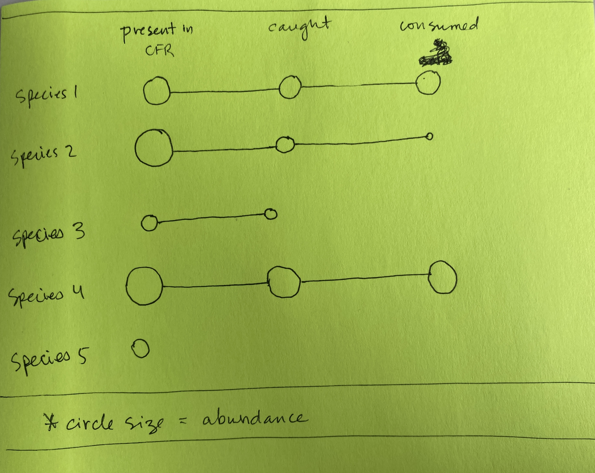

---
title: "Cambodia biodiversity paper notes -- August 8, 2022"
output: 
  pdf_document:
    latex_engine: xelatex
mainfont: Arial

knit: (function(inputFile, encoding) {
  rmarkdown::render(inputFile, encoding = encoding, output_dir = "~/github/cambodia_biodiversity/output") })
---

```{r setup, include=FALSE}
knitr::opts_chunk$set(echo = FALSE, message = FALSE, warning = FALSE)
```


```{r packages, echo = FALSE, include = FALSE}
library(Hmisc) # install.packages("Hmisc") # this package makes summarize not recognize group_by(), use summarise with an s instead. Sometimes ungroup() is needed when you least expect it.
library(lubridate)
library(ggalluvial) # install.packages("ggalluvial")
library(alluvial) #install.packages("alluvial")
library(tidyverse)
library(viridis) #install.packages("viridis")
library (hrbrthemes) #install.packages("hrbrthemes")
library(kableExtra)

projectFolder  <- "~/github/cambodia_biodiversity"
data <- file.path(projectFolder, "data/processed/")
output <-file.path(projectFolder, "output/")

```


```{r read_files}
# bring in csv files generated in stata

# cfr types
cfrtype <- as_tibble(read.csv(file.path(data, "cfr_category.csv"), na.strings = c("", "NA")))

# all dates
dates <- as_tibble(read.csv(file.path(data, "dates.csv"), na.strings = c("", "NA")))

# species codes
scode <- as_tibble(read.csv(file.path(data, "species_codes.csv"), na.strings = c("", "NA")))

# catch data
c <- as_tibble(read.csv(file.path(data, "ccm_q7.csv"), na.strings = c("", "NA")))

# biomonitoring data
b <- as_tibble(read.csv(file.path(data, "biom_formb.csv"), na.strings = c("", "NA")))

# traits data
t <- as_tibble(read.csv(file.path(data, "traits.csv"), na.strings = c("", "NA")))
  # merge codes into 


```


```{r}

## CREATE DATA FRAMES TO BE USED FOR ANALYSIS. All files below ignore time dimension.

# HOUSEHOLD-LEVEL DATA FILES

  # Create a household-level data frame that contains the number of species caught by each household
  hh_catch <- c %>% 
    select(hhid, cfrid, scode_ccm) %>% 
    distinct(hhid, cfrid, scode_ccm) %>%   # nrow(hh_catch) 9687
    group_by(hhid, cfrid) %>% 
    summarise(catch_species = n())
  
  
  # Create household-level data frame that contains the number of species consumed and sold by households
  hh_cons <- c %>% 
    filter(atefresh == 1) %>% 
    distinct(hhid, cfrid, scode_ccm, atefresh) %>% # nrow(hh_consumption) 9032
    group_by(cfrid, hhid) %>% 
    summarise(consumption_species = sum(atefresh))
  
  hh_sold <- c %>% 
    filter(soldfresh == 1) %>% 
    distinct(hhid, cfrid, scode_ccm, soldfresh) %>% # nrow(hh_sold) = 1879
    group_by(cfrid, hhid) %>% 
    summarise(sold_species = sum(soldfresh))
  
  hh_soldcons <- full_join(hh_cons, hh_sold, by = c("cfrid", "hhid")) %>% 
    mutate(sold_species = replace_na(sold_species, 0)) ## replacing 146 NA values with zero
    
    # check NAs
    #sum(is.na(hh_soldcons$sold_species))
    #sum(is.na(hh_soldcons$consumption_species))

## CFR LEVEL DATA FILES

  # Create a CFR-level data frame that contains the number of species caught during CFR biomonitoring
  cfr_biom <- b %>% 
    select(cfrid, scode_biom) %>% 
    distinct(cfrid, scode_biom) %>% # dropping duplicates in terms of CFR and species
    group_by(cfrid) %>% 
    summarise(biom_species = n())
  
    
  ## Combine CFR-level data frames
  cfr_biodiv <- full_join(cfr_biom, hh_catch, by = "cfrid") 
  cfr_biodiv <- full_join(cfr_biodiv, hh_soldcons, by = c("cfrid", "hhid"))


# SPECIES LEVEL DATA FILES

# Create a species-level data frame that contains relative abundance of different species
systemtotal <- b %>% 
  select(totalweight_biom) %>% 
  summarize(systemtotal = sum(totalweight_biom)) %>% 
  as.numeric()

rel_abundance <- b %>% 
  select(scode_biom, totalweight_biom) %>% 
  group_by(scode_biom) %>% 
  summarize(species_total = sum(totalweight_biom)) %>% 
  mutate(rel_abundance = species_total/systemtotal) %>%  # check: summarize(total = sum(rel_abundance)) = 1
  select(scode_biom, rel_abundance) %>% 
  mutate(scode_ccm = scode_biom) # set up key for later merge

# Combine traits and CCM data
ccm_traits <- t %>% 
  mutate(sname_ccm = sname_traits) %>% # unique(ccm_traits$sname_traits) 126 species
  full_join(c, key = "sname_traits") %>%  # unique(ccm_traits$sname_traits) 126 species + NA  
  select(cfrid, hhid, year, month, scode_ccm, sname_traits, soldfresh, atefresh, process, lost, other, ends_with("iweight"), tg, tl, ends_with("content"), ends_with("minbio"), ends_with("rda_100g"), num_rda) %>% 
  drop_na(cfrid, hhid) # Dropping cases where these key identifiers are missing. Allowing missing data in traits vectors.

  # collapse ccm_traits data to species level 
  ccm_traits_specieslevel <- ccm_traits %>% 
    group_by(sname_traits, scode_ccm) %>% 
    summarise(catch = sum(catch_iweight), 
              eat = sum(atefresh_iweight), 
              sell = sum(soldfresh_iweight),
              process = sum(process_iweight),
              num_rda = mean(num_rda), 
              tl = mean(tl))

# Combine species-level traits, ccm and relative abundance data
ccm_traits_specieslevel <- full_join(ccm_traits_specieslevel,rel_abundance, by = "scode_ccm")

```

``` {r, results = FALSE}
# Looking for NA values in species. If there are NA values, they should be replaced with zero.
sum(is.na(cfr_biodiv$biom_species))
sum(is.na(cfr_biodiv$consumption_species))
sum(is.na(cfr_biodiv$sold_species))
sum(is.na(cfr_biodiv$catch_species))

# What is the number of unique species present in each data frame?

numspecies_ccm <- c %>% 
  distinct(scode_ccm) %>% 
  nrow()

numspecies_traits <- t %>% 
  distinct(sname_traits) %>% 
  nrow()

numspecies_biom <- b %>% 
  distinct(sname_biom) %>% 
  nrow()


```

## Plots of diversity at different levels (system, catch, consumption, sold)

In the figures below, diversity is represented by total number of species present in each CFR and household, aggregated over time. They do not account for abundance or variation over time. Each dot represents a household. Below each figure is the Pearson correlation coefficient and pvalue.  
\

**Liz's interpretation:**

* A: System diversity and catch diversity are positively correlated (coeff = 0.38) & estimates are very precise.

* B: System diversity and consumption diversity are positively correlated (coeff = 0.35) & estimates are very precise.

* C: Catch diversity and consumption diversity are very strongly positively correlated (coeff = 0.98!) & estimates are very precise. 
  * There are many species that people are exclusively eating
  * People are eating at least a little bit of virtually all of the fish they catch. Later graphs explore this.

* D: Catch diversity and sold diversity are positively correlated (coeff 0.40) & estimates are very precise.
  * There are no species that are exclusively sold.

* E: There is no statistically significant relationship between system diversity and diversity of fish that are sold. 

Fishing households appear to be consuming a portfolio of fish that is very similar to what they are catching (correlation coeff = 0.98). This is just in terms of presence/absence and does not account for the amount of each species. The similarity in catch and consumption portfolio could be explained by a general preference for diversity among fishing households, or a lack of marketing opportunities for many types of fish (either to buy or to sell), or some combination of both. The decision about which fish to market could be a function of which fish species it is possible to sell, or it could be a function of which fish species are left over after the household has selected a diversity of fish for consumption. 
\
\

```{r biom x catch, out.width = '70%'}

### Biomonitoring X Catch 

# Check correlation stats
corr <- cfr_biodiv %>% 
  select(biom_species, catch_species) %>% 
  as.matrix() %>% 
  Hmisc::rcorr(type = "spearman") %>% 
  broom::tidy() %>% 
  knitr::kable()


# Plot
cfr_biodiv %>% 
  ggplot(aes(x = biom_species, y = catch_species)) +
  geom_point() +
  geom_smooth(method = "lm") +
  theme_bw() +
  ggtitle("A. Biomonitoring (CFR-level) X Catch (HH-level)")

corr

```

\
\

```{r biom x consumption, out.width = '70%'}

### Biomonitoring X Consumption

# Check correlation stats
corr <- cfr_biodiv %>% 
  select(biom_species, consumption_species) %>% 
  as.matrix() %>% 
  Hmisc::rcorr(type = "spearman") %>% 
  broom::tidy() %>% 
  knitr::kable()

# Plot
cfr_biodiv %>% 
  ggplot(aes(x = biom_species, y = consumption_species)) +
  geom_point() +
  geom_smooth(method = "lm") +
  theme_bw() +
  ggtitle("B. Biomonitoring (CFR-level) X Consumption (HH-level)")

corr

```

\
\

```{r catch x consumption, out.width = '70%'}

### Catch X Consumption

# Check correlation stats
corr <- cfr_biodiv %>% 
  select(catch_species, consumption_species) %>% 
  as.matrix() %>% 
  Hmisc::rcorr(type = "spearman") %>% 
  broom::tidy() %>% 
  knitr::kable()

# Plot
cfr_biodiv %>% 
  ggplot(aes(x = catch_species, y = consumption_species)) +
  geom_point() +
  geom_smooth(method = "lm") + 
  geom_abline(intercept = 0, slope = 1, color = "gray") +
  theme_bw() +
  ggtitle("C. Catch (HH-level) X Consumption (HH-level)") 

corr

```

\
\

```{r catch x sold, out.width = '70%'}

### Catch X Sold

# Check correlation stats
corr <- cfr_biodiv %>% 
  select(catch_species, sold_species) %>% 
  as.matrix() %>% 
  Hmisc::rcorr(type = "spearman") %>% 
  broom::tidy() %>% 
  knitr::kable()

# Plot
cfr_biodiv %>% 
  ggplot(aes(x = catch_species, y = sold_species)) +
  geom_point() +
  geom_smooth(method = "lm") +  
  geom_abline(intercept = 0, slope = 1, color = "gray") +
  theme_bw() +
  ggtitle("D. Catch (HH-level) X Sold (HH-level)") 

corr

```

\
\

```{r biom x sold, out.width = '70%'}

### Biomonitoring X Sold

# Check correlation stats
corr <- cfr_biodiv %>% 
  select(biom_species, sold_species) %>% 
  as.matrix() %>% 
  Hmisc::rcorr(type = "spearman") %>% 
  broom::tidy() %>% 
  knitr::kable() 
  # kable_styling(position = "float_left")

# Plot
cfr_biodiv %>% 
  ggplot(aes(x = biom_species, y = sold_species)) +
  geom_point() +
  geom_smooth(method = "lm") +
  theme_bw() +
  ggtitle("E. Biomonitoring (CFR-level) X Sold (HH-level)")

corr

```

\
\


``` {r size}

## BODY SIZE (total length)


# catch x eat
size_catcheat <- ccm_traits_specieslevel %>% 
  ggplot(aes(x = catch, y = eat, size = tl, color = tl)) +
  geom_point() +
  scale_x_continuous(trans = "log1p") +
  scale_y_continuous(trans = "log1p") +
  theme_bw() +
  #geom_smooth(method = "lm", color = "black", show.legend = FALSE) +
  geom_abline(intercept = 0, slope = 1, color = "gray") +
  #geom_abline(intercept = 0, slope = log1p(0.5), color = "#99FFFF") +
  labs(size = "", colour = "Total length") +
  ggtitle("1A. Quantity caught X Quantity eaten X Total length")

# catch x sell
size_catchsell <- ccm_traits_specieslevel %>% 
  ggplot(aes(x = catch, y = sell, size = tl, color = tl)) +
  geom_point() +
  scale_x_continuous(trans = "log1p") +
  scale_y_continuous(trans = "log1p") +
  theme_bw() +
  #geom_smooth(method = "lm", color = "black", show.legend = FALSE) +
  geom_abline(intercept = 0, slope = 1, color = "gray")+
  #geom_abline(intercept = 0, slope = 0.5, color = "#99FFFF") +
  labs(size = "", colour = "Total length") +
  ggtitle("2A. Quantity caught X Quantity sold X Total length")


# eat x sell
size_eatsell <- ccm_traits_specieslevel %>% 
  ggplot(aes(x = eat, y = sell, size = tl, color = tl)) +
  geom_point() +
  scale_x_continuous(trans = "log1p") +
  scale_y_continuous(trans = "log1p") +
  theme_bw() +
  #geom_smooth(method = "lm", color = "black", show.legend = FALSE) +
  labs(size = "", colour = "Total length") +
  geom_abline(intercept = 0, slope = 1, color = "gray") +
  ggtitle("3A. Quantity eaten X Quantity sold X Total length")

```


```{r nutrients}

## NUTRITION

# catch x eat
nutr_catcheat <- ccm_traits_specieslevel %>% 
  ggplot(aes(x = catch, y = eat, size = num_rda, color = num_rda)) +
  geom_point() +
  scale_color_viridis() + theme_bw() +
  scale_x_continuous(trans = "log1p") +
  scale_y_continuous(trans = "log1p") +
  #geom_smooth(method = "lm", color = "black", show.legend = FALSE) +
  geom_abline(intercept = 0, slope = 1, color = "gray") +
  #geom_abline(intercept = 0, slope = 0.5, color = "#99FFFF") +
  labs(size = "", colour = "RDAs Met") +
  ggtitle("1B. Quantity caught X Quantity eaten X RDAs met")

# catch x sell
nutr_catchsell <- ccm_traits_specieslevel %>% 
  ggplot(aes(x = catch, y = sell, size = num_rda, color = num_rda)) +
  geom_point() +
  scale_color_viridis() + theme_bw() +
  scale_x_continuous(trans = "log1p") +
  scale_y_continuous(trans = "log1p") +
  #geom_smooth(method = "lm", color = "black", show.legend = FALSE) +
  geom_abline(intercept = 0, slope = 1, color = "gray") +
  #geom_abline(intercept = 0, slope = 0.5, color = "#99FFFF") +
  labs(size = "", colour = "RDAs Met") +
  ggtitle("2B. Quantity caught X Quantity sold X RDAs met")

# eat x sell
nutr_eatsell <- ccm_traits_specieslevel %>% 
  ggplot(aes(x = eat, y = sell, size = num_rda, color = num_rda)) +
  geom_point() +
  scale_color_viridis() + theme_bw() +
  scale_x_continuous(trans = "log1p") +
  scale_y_continuous(trans = "log1p") +
  #geom_smooth(method = "lm", color = "black", show.legend = FALSE) +
  labs(size = "", colour = "RDAs Met") +
  geom_abline(intercept = 0, slope = 1, color = "gray") +
  ggtitle("3B. Quantity eaten X Quantity sold X RDAs met")

```


```{r size_rda}
## BODY SIZE AND NUTRITION

size_rda <- ccm_traits_specieslevel %>% 
  ggplot(aes(x = num_rda, y = tl)) +
  geom_point() +
  geom_smooth(method = "lm", color = "black") +
  ggtitle("Body size X RDAs met")

# Check correlation stats
size_rda_corr <- ccm_traits_specieslevel %>% 
  ungroup() %>% 
  select(num_rda, tl) %>% 
  drop_na() %>% 
  as.matrix() %>% 
  Hmisc::rcorr(type = "spearman") %>% 
  broom::tidy()%>% 
  knitr::kable()

```

```{r}
## RELATIVE ABUNDANCE

# catch x eat
abundance_catcheat <- ccm_traits_specieslevel %>% 
  ggplot(aes(x = catch, y = eat, size = rel_abundance, color = rel_abundance)) +
  geom_point() +
  scale_color_viridis() + theme_bw() +
  scale_x_continuous(trans = "log1p") +
  scale_y_continuous(trans = "log1p") +
  #geom_smooth(method = "lm", color = "black", show.legend = FALSE) +
  geom_abline(intercept = 0, slope = 1, color = "gray") +
  #geom_abline(intercept = 0, slope = 0.5, color = "#99FFFF") +
  labs(size = "", colour = "Relative abundance") +
  ggtitle("1C. Quantity caught X Quantity eaten X Relative abundance")

# catch x sell
abundance_catchsell <- ccm_traits_specieslevel %>% 
  ggplot(aes(x = catch, y = sell, size = rel_abundance, color = rel_abundance)) +
  geom_point() +
  scale_color_viridis() + theme_bw() +
  scale_x_continuous(trans = "log1p") +
  scale_y_continuous(trans = "log1p") +
  #geom_smooth(method = "lm", color = "black", show.legend = FALSE) +
  geom_abline(intercept = 0, slope = 1, color = "gray") +
  #geom_abline(intercept = 0, slope = 0.5, color = "#99FFFF") +
  labs(size = "", colour = "Relative abundance") +
  ggtitle("2C. Quantity caught X Quantity sold X Relative abundance")

# eat x sell
abundance_eatsell <- ccm_traits_specieslevel %>% 
  ggplot(aes(x = eat, y = sell, size = rel_abundance, color = rel_abundance)) +
  geom_point() +
  scale_color_viridis() + theme_bw() +
  scale_x_continuous(trans = "log1p") +
  scale_y_continuous(trans = "log1p") +
  #geom_smooth(method = "lm", color = "black", show.legend = FALSE) +
  labs(size = "", colour = "Relative abundance") +
  geom_abline(intercept = 0, slope = 1, color = "gray") +
  ggtitle("3C. Quantity eaten X Quantity sold X Relative abundance")


```
\

---


## Plots of quantities caught, eaten and sold

* All plots below are on a log scale.

* The gray diagonal line represents the points at which fishers eat their entire catch of a given species. 

* Each point on these plots represents a given species, aggregated across households and time. 

* For total length plots, the color and size both correspond to total length (e.g. lighter and larger dot --> larger fish). 

* Size is measured by total length from FishBase (or other sources)

* Nutritional value is the number of child-under-5 RDAs met by 100g of a given species (total possible is 6: protein, vitamin A, zinc, calcium, iron, omega-3).

* For RDAs met plots, the color and size both correspond to the number of RDAs met (e.g. lighter and larger dot --> more RDAs met)

\

**Of the fish they catch, what fish are people choosing to eat?**

Overall: Fishers are eating more than half of virtually all species caught.

* Panel 1A: Of the fish they catch, people ate a larger share of smaller fish and are doing something else (probably selling--see below) with some of the larger fish. 
  * Points that are on the 1:1 line (gray line) are cases where all catch is eaten, which seems to be the case more often for rarely caught species.
  * There are no (or very few) species that appear to be caught and never eaten (located at Y = 0, X != 0)
  * *Note: Because of the log scale, we can't interpret distance from the diagonal line linearly.*
  
* Panel 1B: When people catch more nutritious fish, they eat a relatively large share of it relative to (some) less nutritious fish that they catch.
  * Since people seem to be eating a lot of all of the fish they catch, the differentiation is maybe not as exciting.
\

```{r, out.width = '50%'}

size_catcheat 
nutr_catcheat

```

\
\

**Of the fish they catch, what species are people choosing to sell?**


* Panel 2A:  People sell a larger share of their catch of larger species relative to smaller ones. 
  * Species located on the diagonal (gray) line are those where quantity caught = quantity sold. The closer to the gray line, the more they sell. 
  * Species (located at Y = 0) are only eaten and not sold at all. They tend to be smaller species. 

* Panel 2B: People are selling a smaller share of their catch of more nutritious species (probably corresponding to species that they are eating nearly all of in Panel 1B).
  * There are some moderately nutritious fish that are being sold in larger shares (e.g. they're closer to the gray line)
  * There's a cluster of more nutritious fish that are hardly/never sold. This corresponds to the cluster of smaller fish in Panel 2A.

\

``` {r, out.width = '50%'}
size_catchsell
nutr_catchsell
```
\
\

**How are people dividing the species they catch between selling and eating?**


* Panel 3A: There are some species that are exclusively eaten (Y = 0) but there are few/no species that are exclusively sold (X = 0, Y != 0). 
  * The largest species are sold slightly more than eaten. 

* Panel 3B: More nutritious species tend to be eaten almost exclusively or eaten more than sold. 
  * More nutritious species seem to correspond to smaller species in 3A, which is expected. 

\

```{r, out.width = '50%'}
size_eatsell
nutr_eatsell

```
\
\

**How do catch, consumption and sales relate to relative abundance of species?**

* Relative abundance is calculated from biomonitoring data by taking the total biomonitoring catch for each species and dividing it by the total biomonitoring catch across species. 

* This is conceptually different than the quantity caught on the x axis of 1A, 1B, 2A, 2B, but in practice the figures below show that they correspond relatively well, with some mixing in the middle. 

* People are catching, eating and selling more of the highly abundant species, as expected.


\


```{r, out.width = '55%'}
abundance_catcheat
abundance_catchsell
abundance_eatsell

```

\
\

---


**Things we could explore:**

* *Which species and how much of them "make it through" from biomonitoring to catch to people's plates?* Schematic below. 
  * Given that people are consuming some of virtually all of the species they catch, I suspect this the list of species that make it through to people's plates will be long unless there are a lot of species that are simply never or hardly caught. 
  * Based on the figures above, we might expect the "how much" element of the question to be more interesting unless there is variation on other dimensions though--e.g., seasonally, by CFR type, by initial CFR diversity level, or by household characteristics. 

{width=300px}

* *How seasonal are these dynamics?* It may be that in certain seasons, some species are exclusively sold (or eaten), which we would not see in the aggregate analysis above. It may also be that some species are completely non-existent in the system and/or data in some seasons, but not in others.

* *How spatial are these dynamics?* It may be that in certain CFR areas, some species are exclusively sold (or eaten), but we wouldn't see that in the aggregate analysis above. One starting point for exploring this would be to look at above graphs by the 4 CFR types and see how they differ.

* *How do these relationships differ by household characteristics?* It may be that some types of households exclusively eat their fish while others sell it, or it may be that all households are both consuming and engaging in the market. 

* *Are there species that we could identify (using other sources) as high-value in the market?* Where do those species sit within these figures?

* Very difficult to know, but important to keep in mind: To what degree is the decision to eat vs. sell dependent on marketing opportunities vs. preferences. I'm not sure we can really get at this in these data, but we should be thinking about it.


