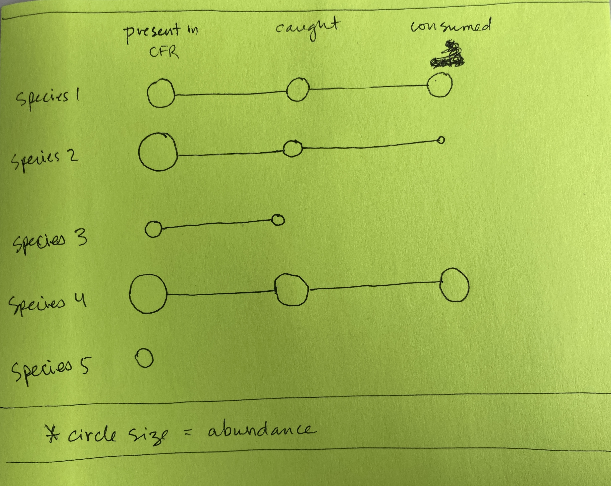

---
title: "Cambodia biodiversity paper notes -- August 31, 2022"
output: 
  pdf_document:
    latex_engine: xelatex
mainfont: Arial

knit: (function(inputFile, encoding) {
  rmarkdown::render(inputFile, encoding = encoding, output_dir = "~/github/cambodia_biodiversity/output") })
---

```{r setup, include=FALSE}
knitr::opts_chunk$set(echo = FALSE, message = FALSE, warning = FALSE)
```

This document is structured around the powerpoint summary dated August 31, 2022. Commentary from earlier versions is removed.

```{r packages, echo = FALSE, include = FALSE}
library(Hmisc) # install.packages("Hmisc") # this package makes summarize not recognize group_by(), use summarise with an s instead. Sometimes ungroup() is needed when you least expect it.
library(lubridate)
library(ggalluvial) # install.packages("ggalluvial")
library(alluvial) #install.packages("alluvial")
library(tidyverse)
library(viridis) #install.packages("viridis")
library (hrbrthemes) #install.packages("hrbrthemes")
library(kableExtra)
library(vegan) #install.packages("vegan")

projectFolder  <- "~/github/cambodia_biodiversity2"
data <- file.path(projectFolder, "data/processed/")
output <-file.path(projectFolder, "output/")

```


```{r read_files}
# bring in csv files generated in stata

# cfr types
cfrtype <- as_tibble(read.csv(file.path(data, "cfr_category.csv"), na.strings = c("", "NA")))

# all dates
dates <- as_tibble(read.csv(file.path(data, "dates.csv"), na.strings = c("", "NA")))

# species codes
scode <- as_tibble(read.csv(file.path(data, "species_codes.csv"), na.strings = c("", "NA")))

# catch data
c <- as_tibble(read.csv(file.path(data, "ccm_q7.csv"), na.strings = c("", "NA")))

# biomonitoring data
b <- as_tibble(read.csv(file.path(data, "biom_formb.csv"), na.strings = c("", "NA")))

# traits data
t <- as_tibble(read.csv(file.path(data, "traits.csv"), na.strings = c("", "NA")))
  # merge codes into 

# effort data
e <- as_tibble(read.csv(file.path(data, "effort.csv"), na.strings = c("", "NA")))


```


```{r make_data_frames}

## CREATE DATA FRAMES TO BE USED FOR ANALYSIS. All files below ignore time dimension.

# HOUSEHOLD-LEVEL DATA FILES

  # Create a household-level data frame that contains the number of species caught by each household
  hh_catch <- c %>% 
    select(hhid, cfrid, scode_ccm) %>% 
    distinct(hhid, cfrid, scode_ccm) %>%   # nrow(hh_catch) 9687
    group_by(hhid, cfrid) %>% 
    summarise(catch_species = n())
  
  
  # Create household-level data frame that contains the number of species consumed and sold by households
  hh_cons <- c %>% 
    filter(atefresh == 1) %>% 
    distinct(hhid, cfrid, scode_ccm, atefresh) %>% # nrow(hh_consumption) 9032
    group_by(cfrid, hhid) %>% 
    summarise(consumption_species = sum(atefresh))
  
  hh_sold <- c %>% 
    filter(soldfresh == 1) %>% 
    distinct(hhid, cfrid, scode_ccm, soldfresh) %>% # nrow(hh_sold) = 1879
    group_by(cfrid, hhid) %>% 
    summarise(sold_species = sum(soldfresh))
  
  hh_soldcons <- full_join(hh_cons, hh_sold, by = c("cfrid", "hhid")) %>% 
    mutate(sold_species = replace_na(sold_species, 0)) ## replacing 146 NA values with zero
    
    # check NAs
    #sum(is.na(hh_soldcons$sold_species))
    #sum(is.na(hh_soldcons$consumption_species))

## Create a household-level effort data frame
effort <- e %>% 
  group_by(hhid) %>% 
  summarize(effort = sum(effort_persondays))

## Create a household-species level data frame that contains the amount of each species caught, consumed, sold, processed etc by household

hh_ccm <- c %>% 
  group_by(hhid, scode_ccm) %>% 
  summarise(catch = sum(catch_iweight),
            eat = sum(atefresh_iweight),
            sold = sum(soldfresh_iweight),
            process = sum(process_iweight),
            lost = sum(lost_iweight),
            other = sum(other_iweight))
        
    
  
## CFR LEVEL DATA FILES

  # Create a CFR-level data frame that contains the number of species caught during CFR biomonitoring
  cfr_biom <- b %>% 
    select(cfrid, scode_biom) %>% 
    distinct(cfrid, scode_biom) %>% # dropping duplicates in terms of CFR and species
    group_by(cfrid) %>% 
    summarise(biom_species = n())
  
    
  ## Combine CFR-level data frames
  cfr_biodiv <- full_join(cfr_biom, hh_catch, by = "cfrid") 
  cfr_biodiv <- full_join(cfr_biodiv, hh_soldcons, by = c("cfrid", "hhid"))


# SPECIES LEVEL DATA FILES

# Create a species-level data frame that contains relative abundance of different species
systemtotal <- b %>% 
  select(totalweight_biom) %>% 
  summarize(systemtotal = sum(totalweight_biom)) %>% 
  as.numeric()

rel_abundance <- b %>% 
  select(scode_biom, totalweight_biom) %>% 
  group_by(scode_biom) %>% 
  summarize(species_total = sum(totalweight_biom)) %>% 
  mutate(rel_abundance = species_total/systemtotal) %>%  # check: summarize(total = sum(rel_abundance)) = 1
  select(scode_biom, rel_abundance) %>% 
  mutate(scode_ccm = scode_biom) # set up key for later merge

# Combine traits and CCM data
ccm_traits <- t %>% 
  mutate(sname_ccm = sname_traits) %>% # unique(ccm_traits$sname_traits) 126 species
  full_join(c, key = "sname_traits") %>%  # unique(ccm_traits$sname_traits) 126 species + NA  
  select(cfrid, hhid, year, month, scode_ccm, sname_traits, soldfresh, atefresh, process, lost, other, ends_with("iweight"), tg, tl, ends_with("content"), ends_with("minbio"), ends_with("rda_100g"), starts_with("num_rda")) %>% 
  drop_na(cfrid, hhid) # Dropping cases where these key identifiers are missing. Allowing missing data in traits vectors.

  # collapse ccm_traits data to species level 
  ccm_traits_specieslevel <- ccm_traits %>%
    # generate RDA variables per nutrient. 1 = 100g of a given species meets 100% of the RDA for that nutrient.
    mutate(vita_rda100 = if_else(vita_rda_100g > 1, 1, 0),
         pr_rda100 = if_else(pr_rda_100g > 1, 1, 0),
         fe_rda100 = if_else(fe_rda_100g > 1, 1, 0),
         o3_rda100 = if_else(o3_rda_100g > 1, 1, 0),
         zn_rda100 = if_else(zn_rda_100g > 1, 1, 0),
         ca_rda100 = if_else(ca_rda_100g > 1, 1, 0)) %>% 
    group_by(sname_traits, scode_ccm) %>% 
    summarise(catch = sum(catch_iweight), 
              eat = sum(atefresh_iweight), 
              sell = sum(soldfresh_iweight),
              process = sum(process_iweight),
              # Calculate number of RDAs met per 100g of a given species at 100% of RDA and 50% of RDA. 
              num_rda100 = mean(num_rda_100), 
              num_rda50 = mean(num_rda_50),
              tl = mean(tl),
              log_tl = log(tl),
              pr_rda100 = max(pr_rda100),
              vita_rda100 = max(vita_rda100),
              fe_rda100 = max(fe_rda100),
              o3_rda100 = max(o3_rda100),
              zn_rda100 = max(zn_rda100),
              ca_rda100 = max(ca_rda100))
              
  
# Combine species-level traits, ccm and relative abundance data
ccm_traits_specieslevel <- full_join(ccm_traits_specieslevel,rel_abundance, by = "scode_ccm")

```

``` {r, results = FALSE}
# Looking for NA values in number of species. If there are NA values, they should be replaced with zero.
sum(is.na(cfr_biodiv$biom_species))
sum(is.na(cfr_biodiv$consumption_species))
sum(is.na(cfr_biodiv$sold_species))
sum(is.na(cfr_biodiv$catch_species))

# What is the number of unique species present in each data frame?

numspecies_ccm <- c %>% 
  distinct(scode_ccm) %>% 
  nrow()

numspecies_traits <- t %>% 
  distinct(sname_traits) %>% 
  nrow()

numspecies_biom <- b %>% 
  distinct(sname_biom) %>% 
  nrow()


```


# System diversity --> Catch diversity plots

\
\

```{r biom x catch, out.width = '70%'}

### Biomonitoring X Catch 

# Plot system diversity and catch diversity
cfr_biodiv %>% 
  ggplot(aes(x = biom_species, y = catch_species)) +
  geom_point(alpha = 0.6) +
  geom_smooth(method = "lm", color = "#008B8B") +
  theme_bw() +
  ggtitle("A. Biomonitoring (CFR-level) X Catch (HH-level)") +
  xlab("Number of species in biomonitoring") +
  ylab("Number of species caught")

# Check correlation stats
corr <- cfr_biodiv %>% 
  select(biom_species, catch_species) %>% 
  as.matrix() %>% 
  Hmisc::rcorr(type = "spearman") %>% 
  broom::tidy() %>% 
  knitr::kable()

corr

# Add effort as an additional dimension
effort1 <- cfr_biodiv %>% 
  full_join(effort, by = "hhid") %>% 
  ggplot(aes(x = biom_species, y = catch_species, color = effort, size = effort)) +
  geom_point(alpha = 0.6) +
  geom_smooth(method = "lm", color = "#008B8B") +
  scale_color_viridis() + 
  theme_bw() +
  ggtitle("A. Biomonitoring X Catch X Effort") +
  xlab("Number of species in biomonitoring") +
  ylab("Number of species caught")

  # Sidenote: What is the relationship between effort and diversity of species caught
  effort2 <- cfr_biodiv %>% 
    full_join(effort, by = "hhid") %>% 
    # filter out person-days > 150
    filter(effort < 150) %>% 
    ggplot(aes(x = catch_species, y = effort)) +
    geom_point(alpha = 0.6) +
    geom_smooth(method = "lm", color = "#008B8B") +
    theme_bw() +
    ggtitle("Relationship between effort and number of species caught") +
    ylab("Effort (person-days in past 7 days)") +
    xlab("Number of species caught in past 7 days")
  
      # look at correlation
      corr <- cfr_biodiv %>% 
        full_join(effort, by = "hhid") %>% 
        # filter out person-days > 150
        filter(effort < 150) %>% 
        select(effort, catch_species) %>% 
        as.matrix() %>% 
        Hmisc::rcorr(type = "spearman") %>% 
        broom::tidy() %>% 
        knitr::kable()
      corr
      
# [PLACEHOLDER FOR SOME DIVERSITY-INDEX BASED LOOK AT THE RELATIONSHIP BETWEEN SYSTEM AND CATCH]
```


\
\

```{r catch x consumption, out.width = '70%'}

### Catch X Consumption

# Plot
cfr_biodiv %>% 
  ggplot(aes(x = catch_species, y = consumption_species)) +
  geom_point(alpha = 0.6) +
  geom_smooth(method = "lm", color = "#008B8B") + 
  geom_abline(intercept = 0, slope = 1, color = "gray") +
  theme_bw() +
  ggtitle("C. Catch (HH-level) X Consumption (HH-level)") +
  xlab("Number of species caught") +
  ylab("Number of species consumed")


# Check correlation stats
corr <- cfr_biodiv %>% 
  select(catch_species, consumption_species) %>% 
  as.matrix() %>% 
  Hmisc::rcorr(type = "spearman") %>% 
  broom::tidy() %>% 
  knitr::kable()

corr

# Add effort as a third dimension
effort4 <- cfr_biodiv %>% 
  full_join(effort, by = "hhid") %>% 
  ggplot(aes(x = catch_species, y = consumption_species, color = effort, size = effort)) +
  geom_point(alpha = 0.6) +
  geom_smooth(method = "lm", color = "#008B8B") +
  scale_color_viridis() + 
  theme_bw() +
  geom_abline(intercept = 0, slope = 1, color = "gray") +
  ggtitle("Catch X Consumption X Effort") +
  xlab("Number of species caught") +
  ylab("Number of species consumed")

# [PLACEHOLDER FOR SOME DIVERSITY-INDEX BASED LOOK AT THE RELATIONSHIP BETWEEN CATCH AND CONSUMPTION --expecting this to be a very strong relationship]

```

\
\

```{r catch x sold, out.width = '70%'}

### Catch X Sold

# Plot
cfr_biodiv %>% 
  ggplot(aes(x = catch_species, y = sold_species)) +
  geom_point(alpha = 0.6) +
  geom_smooth(method = "lm", color = "#008B8B") +  
  geom_abline(intercept = 0, slope = 1, color = "gray") +
  theme_bw() +
  ggtitle("D. Catch (HH-level) X Sold (HH-level)") +
  xlab("Number of species caught") +
  ylab("Number of species sold")

# Check correlation stats
corr <- cfr_biodiv %>% 
  select(catch_species, sold_species) %>% 
  as.matrix() %>% 
  Hmisc::rcorr(type = "spearman") %>% 
  broom::tidy() %>% 
  knitr::kable()

corr

# [PLACEHOLDER FOR SOME DIVERSITY-INDEX BASED LOOK AT THE RELATIONSHIP BETWEEN CATCH AND SOLD]
```


```{r consumption x nutrients}
eat_rda <- hh_ccm %>% 
  select(hhid, scode_ccm) %>% 
  full_join(ccm_traits_specieslevel, by = "scode_ccm") %>% 
  drop_na(pr_rda100) %>% 
  filter(eat > 0) %>%  # drops one observation where household caught something but did not eat it
  group_by(hhid) %>% 
  summarise(species_count = n(),
            pr_rda100 = max(pr_rda100),
            vita_rda100 = max(vita_rda100),
            fe_rda100 = max(fe_rda100),
            o3_rda100 = max(o3_rda100),
            zn_rda100 = max(zn_rda100),
            ca_rda100 = max(ca_rda100)) %>% 
  mutate(rda_met100 = pr_rda100 + vita_rda100 + fe_rda100 + o3_rda100 + zn_rda100 + ca_rda100) %>% 
  drop_na(rda_met100)
            
# Check correlation stats
corr <- eat_rda %>% 
  select(rda_met100, species_count) %>% 
  as.matrix() %>% 
  Hmisc::rcorr(type = "spearman") %>% 
  broom::tidy() %>% 
  knitr::kable() 
  # kable_styling(position = "float_left")

# Plot

# scatter
eat_rda_scatter <- eat_rda %>% 
  ggplot(aes(x = species_count, y = rda_met100)) +
  geom_point(alpha = 0.6) +
  geom_smooth(method = "lm", color = "#008B8B") +
  theme_bw() +
  ggtitle("F. Relationship between number of species consumed and RDAs met")

# boxplot
eat_rda_box <- eat_rda %>% 
  mutate(RDAs = as.factor(rda_met100)) %>% 
  ggplot(aes(y = species_count, x = RDAs, fill = RDAs)) +
  geom_boxplot() +
  geom_jitter(size = 0.4, alpha = 0.5) +
  scale_fill_viridis(discrete = TRUE, alpha = 0.6) + 
  theme_bw() +
  ggtitle("Relationship between number of species consumed and RDAs met") +
  ylab("Number of species consumed") +
  xlab("RDAs met by species portfolio (not weighted by abundance)")
  
eat_rda_box
corr


```

```{r sold x nutrients}
sold_rda <- hh_ccm %>% 
  select(hhid, scode_ccm) %>% 
  full_join(ccm_traits_specieslevel, by = "scode_ccm") %>% #dim() 9694 x 19
  drop_na(pr_rda100) %>% # dim() 7677 x 19
  filter(sell > 0) %>% # dim() 7537 x 19
  group_by(hhid) %>% 
  summarise(species_count = n(),
            pr_rda100 = max(pr_rda100),
            vita_rda100 = max(vita_rda100),
            fe_rda100 = max(fe_rda100),
            o3_rda100 = max(o3_rda100),
            zn_rda100 = max(zn_rda100),
            ca_rda100 = max(ca_rda100)) %>% 
  mutate(rda_met100 = pr_rda100 + vita_rda100 + fe_rda100 + o3_rda100 + zn_rda100 + ca_rda100) %>% 
  drop_na(rda_met100)

# scatter
sold_rda_scatter <- sold_rda %>% 
  ggplot(aes(x = species_count, y = rda_met100)) +
  geom_point(alpha = 0.6) +
  geom_smooth(method = "lm", color = "#008B8B") +
  theme_bw() +
  ggtitle("F. Relationship between number of species sold and RDAs met")

# Check correlation stats
corr <- sold_rda %>% 
  select(rda_met100, species_count) %>% 
  as.matrix() %>% 
  Hmisc::rcorr(type = "spearman") %>% 
  broom::tidy() %>% 
  knitr::kable() 

# boxplot
sold_rda_box <- sold_rda %>% 
  mutate(RDAs = as.factor(rda_met100)) %>% 
  ggplot(aes(y = species_count, x = RDAs, fill = RDAs)) +
  geom_boxplot() +
  geom_jitter(size = 0.4, alpha = 0.5) +
  scale_fill_viridis(discrete = TRUE, alpha = 0.6) + 
  theme_bw() +
  ggtitle("Relationship between number of species sold and RDAs met") +
  ylab("Number of species sold") +
  xlab("RDAs met by species portfolio (not weighted by abundance)")
  
sold_rda_box
corr

```

\
\
```{r}
## RELATIVE ABUNDANCE

# eat x sell
abundance_eatsell <- ccm_traits_specieslevel %>% 
  ggplot(aes(x = eat, y = sell, size = rel_abundance, color = rel_abundance)) +
  geom_point() +
  scale_color_viridis() + theme_bw() +
  scale_x_continuous(trans = "log1p") +
  scale_y_continuous(trans = "log1p") +
  #geom_smooth(method = "lm", color = "black", show.legend = FALSE) +
  labs(size = "", colour = "Relative abundance") +
  geom_abline(intercept = 0, slope = 1, color = "gray") +
  ggtitle("3C. Quantity eaten X Quantity sold X Relative abundance")

# eat x sell at household level
abundance_eatsell_hh <- ccm_traits_specieslevel %>% 
  select(scode_ccm, num_rda100, tl, rel_abundance) %>% 
  full_join(hh_ccm, by = "scode_ccm") %>% 
  arrange(hhid) %>% # dim() #9694 x 12
  filter(sold < 200) %>% 
  ggplot(aes(x = eat, y = sold, color = rel_abundance, size = rel_abundance)) +
  geom_point(alpha = 0.6) +
  scale_x_continuous(trans = "log1p") +
  scale_y_continuous(trans = "log1p") +
  scale_color_viridis() +
  theme_bw() +
  ggtitle("3A: Eaten X Sold X Relative abundance (household level)") +
  xlab("Quantity eaten") +
  ylab("Quantity sold")


# catch x eat
abundance_catcheat <- ccm_traits_specieslevel %>% 
  ggplot(aes(x = catch, y = eat, size = rel_abundance, color = rel_abundance)) +
  geom_point() +
  scale_color_viridis() + theme_bw() +
  scale_x_continuous(trans = "log1p") +
  scale_y_continuous(trans = "log1p") +
  #geom_smooth(method = "lm", color = "black", show.legend = FALSE) +
  geom_abline(intercept = 0, slope = 1, color = "gray") +
  #geom_abline(intercept = 0, slope = 0.5, color = "#99FFFF") +
  labs(size = "", colour = "Relative abundance") +
  ggtitle("1C. Quantity caught X Quantity eaten X Relative abundance")

# catch x sell
abundance_catchsell <- ccm_traits_specieslevel %>% 
  ggplot(aes(x = catch, y = sell, size = rel_abundance, color = rel_abundance)) +
  geom_point() +
  scale_color_viridis() + theme_bw() +
  scale_x_continuous(trans = "log1p") +
  scale_y_continuous(trans = "log1p") +
  #geom_smooth(method = "lm", color = "black", show.legend = FALSE) +
  geom_abline(intercept = 0, slope = 1, color = "gray") +
  #geom_abline(intercept = 0, slope = 0.5, color = "#99FFFF") +
  labs(size = "", colour = "Relative abundance") +
  ggtitle("2C. Quantity caught X Quantity sold X Relative abundance")


```

```{r nutrients}

## NUTRITION

# eat x sell 
nutr_eatsell <- ccm_traits_specieslevel %>% 
  ggplot(aes(x = eat, y = sell, size = num_rda100, color = num_rda100)) +
  geom_point() +
  scale_color_viridis() + theme_bw() +
  scale_x_continuous(trans = "log1p") +
  scale_y_continuous(trans = "log1p") +
  #geom_smooth(method = "lm", color = "black", show.legend = FALSE) +
  labs(size = "", colour = "RDAs Met") +
  geom_abline(intercept = 0, slope = 1, color = "gray") +
  ggtitle("3B. Eaten X Sold X RDAs met") +
  xlab("Quantity eaten") +
  ylab("Quantity sold")


# eat x sell at household level
nutr_eatsell_hh <- ccm_traits_specieslevel %>% 
  select(scode_ccm, num_rda100, tl, rel_abundance) %>% 
  full_join(hh_ccm, by = "scode_ccm") %>% 
  arrange(hhid) %>% # dim() 9694 x 12
  filter(sold < 200) %>% 
  ggplot(aes(x = eat, y = sold, color = num_rda100, size = num_rda100)) +
  geom_point(alpha = 0.6) +
  geom_abline(intercept = 0, slope = 1, color = "gray") +
  scale_x_continuous(trans = "log1p") +
  scale_y_continuous(trans = "log1p") +
  scale_color_viridis() +
  theme_bw() +
  labs(size = "", colour = "RDAs Met") +
  ggtitle("3A: Eaten X Sold X RDAs met (household level)") +
  xlab("Quantity eaten") +
  ylab("Quantity sold")

# catch x eat
nutr_catcheat <- ccm_traits_specieslevel %>% 
  ggplot(aes(x = catch, y = eat, size = num_rda100, color = num_rda100)) +
  geom_point() +
  scale_color_viridis() + theme_bw() +
  scale_x_continuous(trans = "log1p") +
  scale_y_continuous(trans = "log1p") +
  #geom_smooth(method = "lm", color = "black", show.legend = FALSE) +
  geom_abline(intercept = 0, slope = 1, color = "gray") +
  #geom_abline(intercept = 0, slope = 0.5, color = "#99FFFF") +
  labs(size = "", colour = "RDAs Met") +
  ggtitle("1B. Quantity caught X Quantity eaten X RDAs met")


# catch x sell
nutr_catchsell <- ccm_traits_specieslevel %>% 
  ggplot(aes(x = catch, y = sell, size = num_rda100, color = num_rda100)) +
  geom_point() +
  scale_color_viridis() + theme_bw() +
  scale_x_continuous(trans = "log1p") +
  scale_y_continuous(trans = "log1p") +
  #geom_smooth(method = "lm", color = "black", show.legend = FALSE) +
  geom_abline(intercept = 0, slope = 1, color = "gray") +
  #geom_abline(intercept = 0, slope = 0.5, color = "#99FFFF") +
  labs(size = "", colour = "RDAs Met") +
  ggtitle("2B. Quantity caught X Quantity sold X RDAs met")


```

\
\


``` {r size}

## BODY SIZE (total length)

# eat x sell
size_eatsell <- ccm_traits_specieslevel %>% 
  ggplot(aes(x = eat, y = sell, size = tl, color = tl)) +
  geom_point() +
  scale_x_continuous(trans = "log1p") +
  scale_y_continuous(trans = "log1p") +
  scale_color_viridis() +
  theme_bw() +
  #geom_smooth(method = "lm", color = "black", show.legend = FALSE) +
  labs(size = "", colour = "Total length") +
  geom_abline(intercept = 0, slope = 1, color = "gray") +
  ggtitle("3A. Quantity eaten X Quantity sold X Total length")

# eat x sell disaggregated to household level
size_eatsell_hh <- ccm_traits_specieslevel %>% 
  select(scode_ccm, tl, rel_abundance) %>% 
  full_join(hh_ccm, by = "scode_ccm") %>% 
  arrange(hhid) %>% # dim() 9694 x 11
  filter(sold <200) %>% #dim() 9684 x 11
  ggplot(aes(x = eat, y = sold, color = tl, size = tl)) +
  geom_point(alpha = 0.6) +
  scale_x_continuous(trans = "log1p") +
  scale_y_continuous(trans = "log1p") +
  geom_abline(intercept = 0, slope = 1, color = "gray") +
  scale_color_viridis() +
  theme_bw() +
  labs(size = "", colour = "Total length") +
  ggtitle("3A: Eaten X Sold X Total length (household level)") +
  xlab("Quantity eaten") +
  ylab("Quantity sold") 

# catch x eat
size_catcheat <- ccm_traits_specieslevel %>% 
  ggplot(aes(x = catch, y = eat, size = tl, color = tl)) +
  geom_point() +
  scale_x_continuous(trans = "log1p") +
  scale_y_continuous(trans = "log1p") +
  theme_bw() +
  #geom_smooth(method = "lm", color = "black", show.legend = FALSE) +
  geom_abline(intercept = 0, slope = 1, color = "gray") +
  #geom_abline(intercept = 0, slope = log1p(0.5), color = "#99FFFF") +
  labs(size = "", colour = "Total length") +
  ggtitle("1A. Quantity caught X Quantity eaten X Total length")

# catch x sell
size_catchsell <- ccm_traits_specieslevel %>% 
  ggplot(aes(x = catch, y = sell, size = tl, color = tl)) +
  geom_point() +
  scale_x_continuous(trans = "log1p") +
  scale_y_continuous(trans = "log1p") +
  theme_bw() +
  #geom_smooth(method = "lm", color = "black", show.legend = FALSE) +
  geom_abline(intercept = 0, slope = 1, color = "gray")+
  #geom_abline(intercept = 0, slope = 0.5, color = "#99FFFF") +
  labs(size = "", colour = "Total length") +
  ggtitle("2A. Quantity caught X Quantity sold X Total length")


```


  
```{r size_rda}
## BODY SIZE AND NUTRITION

size_rda <- ccm_traits_specieslevel %>% 
  ggplot(aes(x = num_rda100, y = tl)) +
  geom_point() +
  geom_smooth(method = "lm", color = "black") +
  ggtitle("Body size X RDAs met")

# Check correlation stats
size_rda_corr <- ccm_traits_specieslevel %>% 
  ungroup() %>% 
  select(num_rda100, tl) %>% 
  drop_na() %>% 
  as.matrix() %>% 
  Hmisc::rcorr(type = "spearman") %>% 
  broom::tidy()%>% 
  knitr::kable()

```

\

---


**Things we could explore:**

* *Which species and how much of them "make it through" from biomonitoring to catch to people's plates?* Schematic below. 
  * Given that people are consuming some of virtually all of the species they catch, I suspect this the list of species that make it through to people's plates will be long unless there are a lot of species that are simply never or hardly caught. 
  * Based on the figures above, we might expect the "how much" element of the question to be more interesting unless there is variation on other dimensions though--e.g., seasonally, by CFR type, by initial CFR diversity level, or by household characteristics. 

{width=300px}

* *How seasonal are these dynamics?* It may be that in certain seasons, some species are exclusively sold (or eaten), which we would not see in the aggregate analysis above. It may also be that some species are completely non-existent in the system and/or data in some seasons, but not in others.

* *How spatial are these dynamics?* It may be that in certain CFR areas, some species are exclusively sold (or eaten), but we wouldn't see that in the aggregate analysis above. One starting point for exploring this would be to look at above graphs by the 4 CFR types and see how they differ.

* *How do these relationships differ by household characteristics?* It may be that some types of households exclusively eat their fish while others sell it, or it may be that all households are both consuming and engaging in the market. 

* *Are there species that we could identify (using other sources) as high-value in the market?* Where do those species sit within these figures?

* Very difficult to know, but important to keep in mind: To what degree is the decision to eat vs. sell dependent on marketing opportunities vs. preferences. I'm not sure we can really get at this in these data, but we should be thinking about it.


